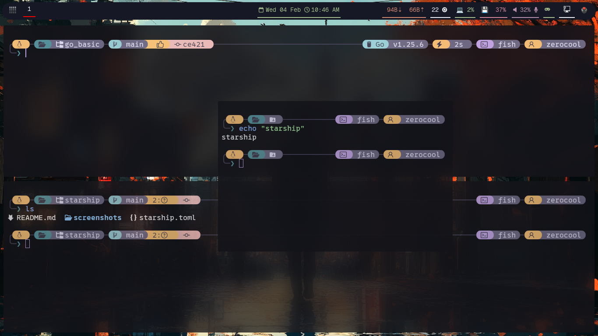

✨ Rosé Pine Starship Prompt
===========================

A beautiful Starship prompt configuration with Rosé Pine color scheme and elegant box-drawing characters.

🎨 Features
-----------

-   🌸 **Rosé Pine Color Scheme** - Beautiful pastel colors inspired by Rosé Pine theme
-   📦 **Boxed Design** - Clean segmented modules with rounded borders
-   🐧 **OS Detection** - Shows your current operating system with icon
-   📂 **Smart Directory** - Custom icons for common folders (Documents, Downloads, Music, etc.)
-   🔀 **Git Integration** - Branch, status, commit hash, and state indicators
-   💻 **Language Support** - Node.js, Python, Java, Lua, Go, C, Rust, Zig, .NET
-   ⏱️ **Command Duration** - Shows execution time for long-running commands
-   🐚 **Shell Indicator** - Displays current shell (Fish, PowerShell, etc.)
-   🕐 **Time Display** - Optional time module (disabled by default)
-   👤 **Username Display** - Always shows current user

📸 Screenshots
--------------

### Main Prompt




📋 Requirements
---------------

-   [Starship](https://starship.rs/) >= 1.10.0
-   A [Nerd Font](https://www.nerdfonts.com/) (required for icons)
    -   Recommended: FiraCode Nerd Font, JetBrains Mono Nerd Font, or Hack Nerd Font
-   Terminal with true color (24-bit) support
-   Optional: Fish, Zsh, Bash, or PowerShell

🚀 Installation
---------------

### 1\. Install Starship

**Linux/macOS:**

```
curl -sS https://starship.rs/install.sh | sh

```

**Arch/Garuda Linux:**

```
sudo pacman -S starship

```

**Windows (PowerShell):**

```
winget install --id Starship.Starship

```

### 2\. Install a Nerd Font

Download and install a [Nerd Font](https://www.nerdfonts.com/font-downloads):

**Recommended fonts:**

-   [FiraCode Nerd Font](https://github.com/ryanoasis/nerd-fonts/releases/download/v3.1.1/FiraCode.zip)
-   [JetBrains Mono Nerd Font](https://github.com/ryanoasis/nerd-fonts/releases/download/v3.1.1/JetBrainsMono.zip)
-   [Hack Nerd Font](https://github.com/ryanoasis/nerd-fonts/releases/download/v3.1.1/Hack.zip)

**Linux installation:**

```
# Extract to fonts directory
mkdir -p ~/.local/share/fonts
unzip FiraCode.zip -d ~/.local/share/fonts
fc-cache -fv

```

**Configure your terminal to use the Nerd Font**

### 3\. Install the Configuration

**Option 1: Download directly**

```
# Backup existing config (if any)
mv ~/.config/starship.toml ~/.config/starship.toml.backup

# Download the config
curl -o ~/.config/starship.toml https://raw.githubusercontent.com/YOUR_USERNAME/YOUR_REPO/main/starship.toml

```

**Option 2: Clone and copy**

```
# Clone this repository
git clone https://github.com/YOUR_USERNAME/YOUR_REPO.git

# Copy the config file
cp YOUR_REPO/starship.toml ~/.config/starship.toml

```

### 4\. Initialize Starship in Your Shell

**Bash** - Add to `~/.bashrc`:

```
eval "$(starship init bash)"

```

**Zsh** - Add to `~/.zshrc`:

```
eval "$(starship init zsh)"

```

**Fish** - Add to `~/.config/fish/config.fish`:

```
starship init fish | source

```

**PowerShell** - Add to your profile (`$PROFILE`):

```
Invoke-Expression (&starship init powershell)

```

### 5\. Reload Your Shell

```
# Bash
source ~/.bashrc

# Zsh
source ~/.zshrc

# Fish
source ~/.config/fish/config.fish

# PowerShell - restart terminal or run:
. $PROFILE

```

🎨 Color Palette
----------------

This configuration uses the **Rosé Pine** color palette:

| Color | Hex Code | Usage |
| --- | --- | --- |
| Foreground | `#e0def4` | Main text |
| Background | `#191724` | Terminal background |
| Current Line | `#403d52` | Borders and separators |
| Blue | `#31748f` | C, Lua modules |
| Cyan | `#9ccfd8` | Git branch, Python, Go |
| Green | `#56949f` | Directory, Node.js |
| Orange | `#f6c177` | OS icon, command duration |
| Pink | `#ebbcba` | Git status |
| Purple | `#c4a7e7` | .NET, shell, time |
| Red | `#eb6f92` | Git state, Java, Rust |
| Yellow | `#f6c177` | Git status, username |

🎯 Module Overview
------------------

### OS Icon

Shows your operating system with icon (Arch, Garuda, Ubuntu, Windows, macOS, etc.)

### Directory

-   Custom folder icons for common directories
-   Shows only last 2 segments of path
-   Read-only indicator when applicable
-   Icons: 󰈙 Documents, Downloads, 󰝚 Music, Pictures, 󰲋 Developer

### Git Information

-   **Branch**: Shows current branch with icon
-   **Status**: Indicators for staged, modified, untracked, deleted files
-   **Commit**: Short commit hash (5 characters)
-   **State**: Rebase, merge, cherry-pick, bisect indicators

### Language Versions

Automatically detected when relevant files are present:

-   󰎙 Node.js
-   Python
-   Java
-   Lua
-   Go
-   C
-   Rust
-   Zig
-   .NET

### Command Duration

Shows execution time for commands taking longer than 500ms

### Username

Always displays current user with icon

⚙️ Customization
----------------

### Enable Time Display

Edit `~/.config/starship.toml` and change:

```
[time]
disabled = false  # Change from true to false

```

### Change Directory Truncation

```
[directory]
truncation_length = 3  # Change from 2 to show more path segments

```

### Modify Command Duration Threshold

```
[cmd_duration]
min_time = 1000  # Change to 1 second (from 500ms)

```

### Customize Directory Icons

Add more substitutions:

```
[directory.substitutions]
"Projects" = "󰲋 "
"Workspace" = " "

```

### Change Color Scheme

Modify the `[palettes.rosepine]` section to use your preferred colors.

🐛 Troubleshooting
------------------

### Icons Not Showing

**Problem**: Boxes or question marks instead of icons

**Solutions:**

1.  Install a Nerd Font (see Installation section)
2.  Configure your terminal to use the Nerd Font
3.  Verify font is installed: `fc-list | grep "Nerd"`

### Colors Look Wrong

**Problem**: Colors appear different or washed out

**Solutions:**

1.  Ensure terminal supports 24-bit true color
2.  Try different terminal emulators (Kitty, Alacritty, WezTerm)
3.  Check terminal color settings

### Prompt is Slow

**Problem**: Noticeable delay when displaying prompt

**Solutions:**

1.  Disable unused modules
2.  Increase `min_time` for `cmd_duration`
3.  Check if you're in a large git repository

### Git Status Not Updating

**Problem**: Git status doesn't refresh

**Solutions:**

1.  Reload shell: `source ~/.bashrc` (or your shell config)
2.  Check git repository is valid
3.  Try `git status` manually to verify git works

### Borders Look Broken

**Problem**: Box-drawing characters don't connect properly

**Solutions:**

1.  Use a terminal with proper Unicode support
2.  Try Kitty, Alacritty, or WezTerm
3.  Ensure font supports box-drawing characters

🎨 Terminal Recommendations
---------------------------

For the best experience, use these terminals:

-   **Kitty** - Fast, feature-rich, excellent font rendering
-   **Alacritty** - GPU-accelerated, minimal, fast
-   **WezTerm** - Cross-platform, highly configurable
-   **Windows Terminal** - Best option for Windows users

📝 Supported Operating Systems
------------------------------

The configuration detects and displays icons for:

Alpine, Amazon, Android, Arch, CentOS, Debian, EndeavourOS, Fedora, FreeBSD, Garuda, Gentoo, Linux, macOS, Manjaro, Mint, NixOS, OpenBSD, Pop!_OS, Raspbian, RedHat, Solus, SUSE, Ubuntu, Windows, and more!


🌟 Acknowledgments
------------------

-   [Starship](https://starship.rs/) - The amazing cross-shell prompt
-   [Rosé Pine](https://rosepinetheme.com/) - Beautiful color palette
-   [Nerd Fonts](https://www.nerdfonts.com/) - Icon fonts


⭐ If you found this useful, please star the repository!